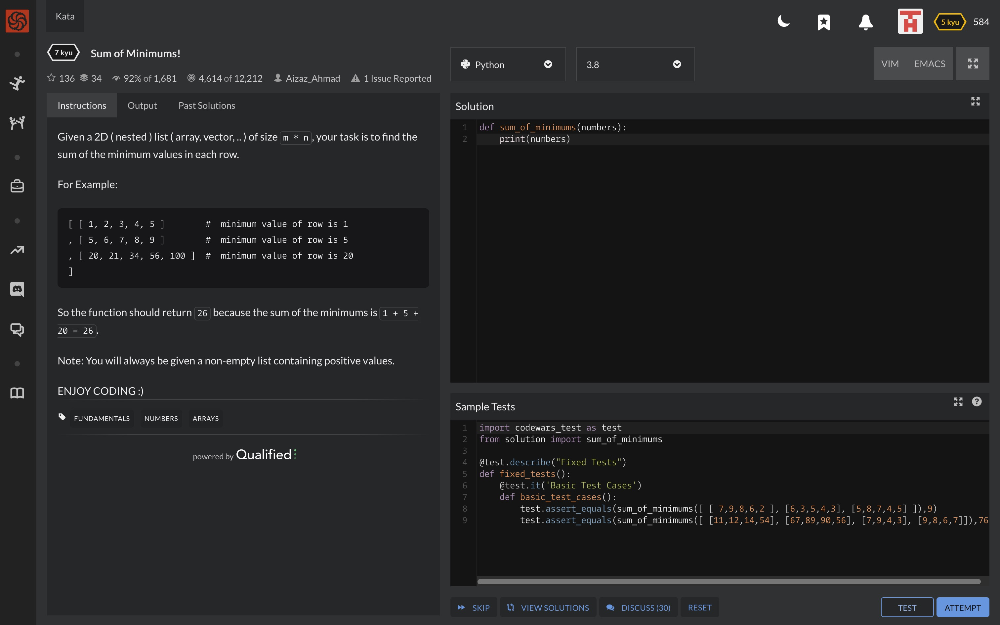

## Описание

В этом задании Вам нужно будет решить все задачи из прикрепленной коллекции.

Каждую решенную задачу Вам нужно будет закоммитить.

> ВАЖНО! После того, как проверка на сайте будет выполнена, не забудьте нажать на Submit, чтобы эта задача у Вас засчиталась как выполненная.

## Пример

Дается задача, написать программу, которая выведет сообщение "hello world"

Дается шаблон для задачи

```python
def hello_world():
    # your solution here
    pass
```

Вы создаете файл hello_world.py

```python
def hello_world():
    return "hello world"
```

И потом пишите следующие комманды, чтобы опубликовать Ваше решение в своем репозитории.

`git add hello_world.py`

`git commit -m "MEGA-2 solve hello_world problem"`

`git push -u origin main`

## Пример #2

Давайте разберем настоящую задачу из Codewars

Здесь Вам нужно найти сумму минимальных значений из каждого списка в данном 2D массиве. Допустим, Вы написали решение. Чтобы проверить его, Вы можете нажать на кнопку Test.


Если Вы уверены, что Ваше решение удовлетворяет каждое условие из задачи, то Вы можете нажать на кнопку Attempt.


Если Ваше решение прошло все тесты и в этот раз, то не забудьте нажать Submit!


После решения, вы создаете файл 01_sum_of_minimums.py

В котором пишите свое решение и загружаете в свой репозиторий с помощью комманд git:

1. `git add 01_sum_of_minimums.py`
2. `git commit -m "MEGA-2 solve sum of minimums"`
3. `git push -u origin main`